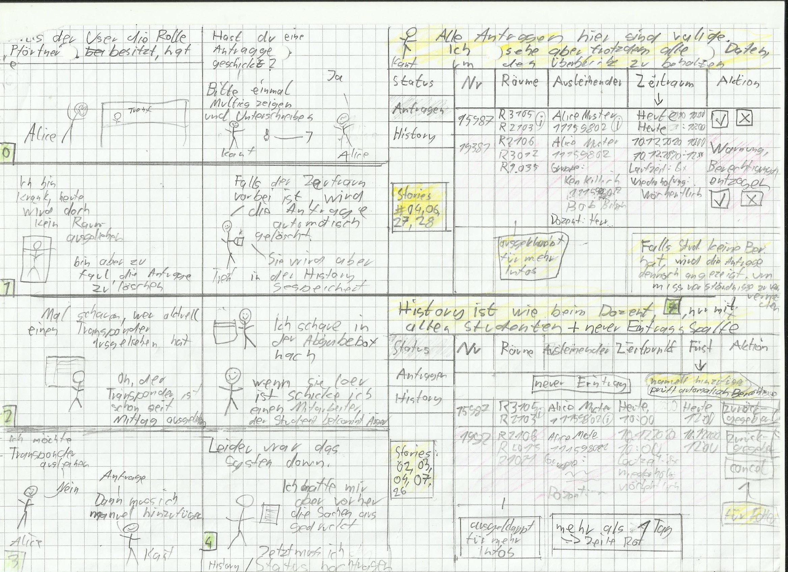
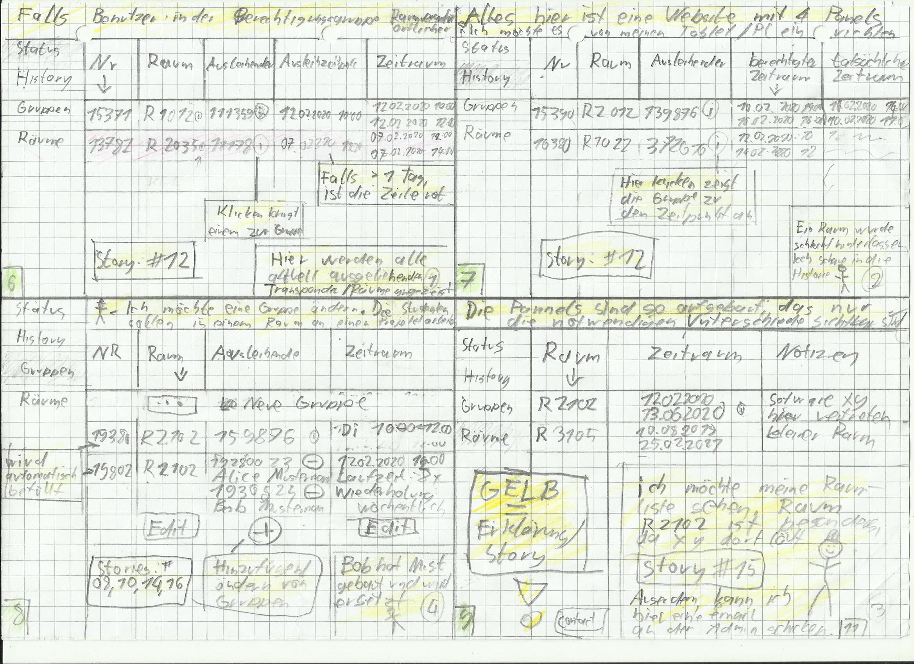

# Einleitung

Dieses Dokument gliedert sich nach den Artefakten des Praktikums. Ab
Meilenstein 2 werden die vorhandenen Artefakte auf Basis von Feedback
und Evaluationen überarbeitet.

Was in den jeweiligen Abschnitten zu erbringen ist, wird immer über
*\[Platzhalter\]* gekennzeichnet. Hierbei gibt es zwei Arten von
Kennzeichnungen:

### *\[Artefakt/e\]*

Platzhalter für das jeweilige Artefakt welches es anzufertigen bzw. zu
überarbeiten gilt z.B. Personas.

### *\[Erläuterung\]*

Platzhalter für eine Erläuterung des jeweiligen Artefakts. Hierbei ist
keine Erläuterung der Methode oder Technik gemeint, sondern vielmehr
eine Begründung von Entscheidungen. Warum wurden ausgerechnet diese
Personas erstellt? Warum sind Elemente im Wireframe wie im Artefakt
ersichtlich angeordnet?\
Dieser Punkt ist essenziell für das Bewertungskriterium „Dokumentation".
Der wichtigste Anhaltspunkt ist hierbei das Feedback seitens
Praktikumsbetreuer und im Review.

**Sie schreiben in Schwarz!**

# Szenario

Nach Ihrem erfolgreichen Studium sind Sie Mitarbeiter/-in der
Softwareschmiede \"Best Practice GmbH\". Ihr Unternehmen konzentriert
sich auf maßgeschneiderte Softwarelösungen und die Digitalisierung von
Arbeitsprozessen.

Das neueste Projekt, welches gleichzeitig Ihren Einstieg in den
Geschäftsalltag darstellt, erhielt Ihr Unternehmen durch die
\"TH-Köln\".

Am Campus Gummersbach ist es mit entsprechenden Berechtigungen möglich,
Transponder zum Öffnen von Räumen auszuleihen. Der Prozess zum
Ausleihen, dem Prüfen von Berechtigungen, als auch dem Verleihen von
Berechtigungen erfolgt dabei rein auf ausgedruckten Listen.

Die Raumverantwortlichen übermitteln hierzu Berechtigungen an die
Pforte. Hier führen die Mitarbeiter/-innen an der Pforte eine Liste mit
allen Schlüsseln und den dazugehörigen Personen, die die Berechtigung
zum Ausleihen eines Transponders besitzen. Ein Transponder kann dabei
mehrere Räume öffnen. Möchte eine Person nun einen Transponder
ausleihen, ist es durch die Mitarbeiter/-innen an der Pforte notwendig,
die Person und seine entsprechende Berechtigung in den entsprechenden
Listen zu überprüfen. Besitzt diese Person die entsprechende
Berechtigung, trägt sie sich mit Datum, Uhrzeit und Namen in eine
Verleihliste ein.

Die aktuelle Handhabung ist sehr pflege-intensiv und widerspricht den
Leitkriterien guter Usability nach DIN ISO 9241-11: Effektivität,
Effizienz und Zufriedenheit.

Ihre Aufgabe ist es, den Transponderverleih der TH Köln am Campus
Gummersbach zu optimieren. Hierzu entwickeln Sie im Laufe des Projekts
ein Konzept, welches sie prototypisch implementieren und testen.

# Spezifikation

## Nutzungskontext verstehen und beschreiben

### Stakeholder Analyse

[//]: # (https://tableconvert.com/)

#### Changelog

 **Datum** | **Was wurde geändert?** | **Warum wurde es geändert?** 
-----------|-------------------------|------------------------------
10.5.2020  | initial commit          | damit es da ist                             
           |                         |                              
           |                         |                              
           |                         |                              
           |                         |                              

__***\[Artefakt/e\]***__

$~$

__**Ausleihender  - primary stakeholder**__  

__Ziele__

möchte schnell und einfach in für ihn relevanten Räumen arbeiten können. 

__Einstellung zum Projekt:__

positiv

__Einfluss des Stakeholders:__

direkt (niedrig)

__Impact/Machteinfluss:__

hoch

---

__**Papierverkäufer  - Antiuser**__  

__Ziele:__

Verdient Geld damit Papier zu verkaufen, das zur aktuellen Verwaltung verwendet wird.

__Einstellung zum Projekt:__

negativ

__Einfluss des Stakeholders:__

indirekt (sehr niedrig)

__Impact/Machteinfluss:__

sehr gering

---

__**Pförtner - primary stakeholder**__

__Ziele:__

Er möchte Transponder ausleihen und über den Status aller Transponder informiert werden.

__Einstellung zum Projekt:__

positiv

__Einfluss des Stakeholders:__

direkt (hoch)

__Impact/Machteinfluss:__

hoch

---

__**technik ablehnender Pförtner - primary stakeholder**__

__Ziele:__

Möchte, das alles so bleibt wie es ist da nur er das aktuelle System versteht und er dadurch eine gesicherte Stelle hat

__Einstellung zum Projekt:__

negativ

__Einfluss des Stakeholders:__

direkt (mittel)

__Impact/Machteinfluss:__

mittel

---

__**Raumverantwortlicher - primary stakeholder**__

__Ziele:__

Verwaltet Zugriff auf die ihn zugewiesenen Räume.
Sort dafür, das sie immer in einem guten Zustand sind.

__Einstellung zum Projekt:__

positiv

__Einfluss des Stakeholders:__

direkt (hoch)

__Impact/Machteinfluss:__

mittel

---

__**Administrator - primary stakeholder**__ 

__Ziele:__

Wartet fertiges System,
sowie Räume und Verantwortlicher.
Sorgt dafür, das das System sicher und stabil läuft

__Einstellung zum Projekt:__

neutral

__Einfluss des Stakeholders:__

direkt (mittel)

__Impact/Machteinfluss:__

mittel

---

__**Auftraggeber - primary stakeholder**__

__Ziele:__

Will die TH-Koeln effizienter machen

__Einstellung zum Projekt:__

positiv

__Einfluss des Stakeholders:__

direkt (niedrig)

__Impact/Machteinfluss:__

hoch

__***\[Erläuterung\]***__

$~$

Die hier dargestellten primären Stakeholder sind die hauptsächlichen Nutzer des Systems. 
Diese sind die Personen, welche tagtäglich mit dem System in Berührung kommen werden und damit am wichtigsten fuer uns sind.
Das gemeinsame Ziel dieser ist es, das bestehende System effizienter zu machen.
 
Die hier dargestellten Anti-User haben dabei eher eine kleinen Einfluss.
Deswegen werden wir vor allem auf die Stakeholder Ausleihender, Pförtner, Raumverantwortlicher und Administrator eingegehen.

### User Profiles  

__**Changelog**__

[//]: # (https://tableconvert.com/)

 **Datum** | **Was wurde geändert?** | **Warum wurde es geändert?** 
-----------|-------------------------|------------------------------
10.5.2020  | initial commit          | damit es da ist                             
           |                         |                              
           |                         |                              
           |                         |                              
           |                         |                              

__***\[Artefakt/e\]***__

$~$

___Student___
  
alter: 16-99

__Charakteristiken__

Sind meistens jung (16-30) und haben daher meist niedrigeres Einkommen.
Sind meistens per E-Mail oder Telefon gut erreichbar.
Haben einen hohen Anspruch an Usability da sie viele Apps verwenden.

__Kenntnisse__

- Sehr affin mit Mobile-Apps.
- Sehr affin mit Websites.
- Affin mit Desktop-Applikationen.
- Teilweise keine Erfahrung mit dem Ausleihe-Verfahren.

__Motivation__

Da Studenten oft Transponder für Praktika und Projekte ausleihen müssen, brauchen sie hier eine bessere und schnellere Lösung.
Außerdem sind Studenten viel unterwegs, deswegen bietet sich hier eine Mobile-App an.
Des Weiteren gibt es Studenten, die den Ablauf nicht kennen. Daher braucht man ein interaktives Tutorial für den ersten
Gebrauch.

---

___Pförtner___

alter: 25-65

__Charakteristiken__

Sind meistens im Job immer erreichbar.
Sind meistens affin mit Sicherheits-/Überwachungssystemen und haben generell technische Kompetenz.
Sie wechseln selten den Standort.

__Kenntnisse__

Arbeiten hauptberuflich und sind so meistens erfahren mit ähnlicher Software. 
Sind meistens affin mit apps und handys.

__Motivation__

Da dies eine regelmäßige Tätigkeit ist, hat der Pförtner sehr starkes Interesse an einer effektiveren Lösung.
Aufgrund des festen Standorts bietet sich eine Desktop- oder Webapplikation an.

---

___Dozent___

alter: 30-65

__Charakteristiken__

Sind meistens sehr gut per E-Mail erreichbar, auch außerhalb der Arbeitszeiten.
Haben meistens wenig Zeit.

__Kenntnisse__

Haben meistens wenig bis gute Technikkenntnisse mit Mobile-apps

__Motivation__

Aufgrund der wenigen Zeit ist es für Dozenten sehr ansprechend, einen schnelleren und simpleren Prozess zu haben.
Da Dozenten oft noch Mitarbeiter haben, brauchen sie Funktionen zum Delegieren.

---

___Administratoren___

Alter: 25-45

__Charakteristiken__

Sind meistens sehr gut per E-Mail und Telefon erreichbar.
Arbeiten meist privat mit ähnlicher Technik.
Haben meist durchschnittlich viel Zeit.
Kommen aus der Technik-Branche.

__Kenntnisse__

Sind meistens sehr affin mit Mobile-Apps.
Sind meistens sehr affin mit Websites.
Sind meistens affin mit Desktop-applications.
Insgesamt sehr versiert im technischen Bereich.

__Motivation__

Der Administrator arbeitet tagtäglich mit der Software, deswegen ist eine schneller, simplerer Prozess als zurzeit zu bevorzugen.
Außerdem will er eine strukturierte Verwaltung sicherstellen, sodass er seinen Job besser erledigen kann.
Hat eventuell einen geringeren Anspruch an usability als andere Nutzer, hingegen legt er Wert auf Authentifizierung und
umfangreiche Funtkionalität.

__***\[Erläuterung\]***__  

$~$

Diese User Profiles beschreiben die Benutzer, die hauptsächlich mit unseren System arbeiten müssen.

### Personas  

__**Changelog**__  

[//]: # (https://tableconvert.com/)

 **Datum** | **Was wurde geändert?** | **Warum wurde es geändert?** 
-----------|-------------------------|------------------------------
10.5.2020  | initial commit          | damit es da ist                             
           |                         |                              
           |                         |                              
           |                         |                              
           |                         |                              

__***\[Artefakt/e\]***__

$~$

___Moe, die studentische Hilfskraft (Student)___

Moe ist eine studentische Hilfskraft an der TH-Köln, er verwaltet die Zugangsrechte der Studierenden, die im Moment an Projekten
arbeiten. Er selbst hat bereits eine Projektarbeit absolviert, deshalb kennt er sich mit den Bedürfnissen der Studenten sehr gut aus.

Rückblickend findet er gut, dass sein Team damals einen festen Raum zur Verfügung hatte, da sie dort mit Geräten/Lizenzen der TH arbeiten konnten.

Allerdings war das Ausleihen des entsprechenden Transponders oft ein Problem, da der Prozess sehr langwierig war. Er meint, dass das unter anderem daran lag,
dass die Pförtner die Berechtigungen jedes Mal in einem Dokument am PC nachschlagen und danach den Transponder anhand einer Nummer suchen
mussten. Gerade bei neuen Mitarbeitern dauere das Ausleihen besonders lange, da diese noch nicht so viel Erfahrung hatten. Außerdem
musste jeder Transponder bei dem Ausleihen in einem Buch protokolliert werden und bei der Rückgabe quittiert werden. Deshalb empfand Moe den
Prozess oft als störend und anstrengend.

Ein weiteres Problem war für ihn und sein Team, dass das sie nicht wussten, ob sich schon jemand im Raum befindet, was bedeutete, dass sie
oft zum Pförtner liefen, obwohl es gar nicht nötig war.

Auch denkt Moe, dass das aktuelle System zur Konfiguration der Transponder nicht optimal ist, da es zu Überschneidungen bei der Ausleihe kommen
kann. Deshalb musste Moe teilweise zu Leuten gehen, die nichts damit zu tun hatten, damit diese Räume auf oder zu schließen können. Das war
unangenehm für Moe, weswegen er sich eine einfachere Lösung wünscht.

Ebenso fand er es komisch, wenn er andere Studierende, welche ebenfalls auf der Suche waren, aus dem Raum hinauswerfen musste. Aber er 
war schließlich für die Ordnung im Raum verantwortlich.

---

___Erika Musterfrau und Max Mustermann (Student)___

Erika Musterfrau und Max Mustermann sind Informatik Studenten im fünften Semester und nehmen an einem Projekt teil, bei dem Sie auf einen
Transponder angewiesen sind. 

Beim Ausleihen kam es jedoch zu mehreren Problemen. Die E-Mail mit den Berechtigungen kam beim Pförter nicht an. Also musste bei Oliver Simpson
angerufen werden um die Berechtigung nachträglich zu holen, was den Beiden unnötige Zeit gekostet hat. 

Auch hat den beiden Zeit gekostet, dass der Transponder den sie ausleihen möchten, schon verliehen war. Also musste nochmal bei Oliver Simpson 
angerufen werden um eine Berechtigung für einen anderen Transponder zu holen.

Das letzte Problem der beiden war, dass die Abgabe des Transponders nicht genau besprochen wurde. Dadurch haben sie Zeit verschwendet um
auf den Pförtner zu warten.

Ihnen würde es Helfen, wenn die Verwaltung der Transponder zentral ablaufen würde. 

---

___Frau Zelador (Pförtner)___

Als Frau Zelador davon hörte, dass Rex der System-Administrator sich für ein besseres Verwaltungssystem der Transponder aussprach, fielen ihr augenblicklich ein duzend Mängel am aktuellen Ausleihverfahren ein.
Oft ist das Problem fehlende Kommunikation zwischen allen Beteiligten.
Dann kommt es dazu dass viel Zeit vergeht und Studenten nicht an ihre Berechtigungen kommen.

Besonders erinnert sie sich an den einen Morgen, als zwei Studenten vor meiner Pforte standen und um einen Transponder baten, für den sie angeblich berechtigt seien, es laut Liste allerdings nicht waren. 
Erst nach einem Anruf bei Herrn Simpson – der die Mail nur an Frau Zeladors krankgeschriebenen Kollegen gemailt hatte – und einem Griff ins Postfach konnte sie die Liste manuell bearbeiten.
Nun haben die Studenten zwar ihre Berechtigung, allerdings fehlte entsprechender Schlüssel. 
Nachdem sie die Liste zurückgesetzt hatte stellte sie fest, dass bereits jemand anderes den Raum seit ein paar Stunden belegte. 
Eine erneute Rücksprache mit Herrn Simpson war nötig, um zu erfahren, dass es sich um einen Fehler gehandelt habe und auch dieser Student eine Erlaubnis hatte, allerdings von einem anderen Dozenten.

Es passiert ziemlich oft, dass sie Studenten aus ein und demselben Team erklären musste, dass einer ihrer Gruppenmitglieder bereits bei ihr war. 
Sie erwartet von einem neuen System, dass eine klare Kommunikation zwischen ihr und den Dozenten untereinander besteht und Einträge nicht mehr von Hand erfasst werden müssen und aufgrund inkonsistenter Daten überschneidet. 
Außerdem sollen Studenten die Möglichkeit besitzen, online über die Verfügbarkeit ihres Transponders bescheid zu wissen, um unnötige Wege zur Pforte vermeiden zu können

---

___Oliver Simpson (wissenschaftlicher Mitarbeiter)___
 
Oliver Simpson ist wissenschaftlicher Mitarbeiter im KI-Labor des Campus Gummersbach und muss daher oft die Berechtigung für die Transpondervergabe erteilen.
Er kennt die Seite des Studenten, und wie nervig es sein kann, nicht rechtzeitig in den Raum zu können und deshalb wertvolle Arbeitszeit zu verlieren.
Daher ist es im besonders wichtig, das Missverständnisse hinsichtlich der Ausgabe nicht vorkommen und versucht daher die Daten möglichst aktuell zu bleiben.

Oliver fehlt dabei besonders eine zentrale Verwaltung der Transponder. 
Dies würde die Berechtigungsliste immer aktuell halten.
Das würde auch Fehler vermeiden, wo durch Fehlen bestimmter Personen Missverständnisse auftreten.

---

___Pr Dr Intelligence (Dozent)___

Seid 5 Jahren doziere ich an der Th-Köln. 
Um meinen Lehre praxisbezogener zu machen, lasse ich meine Studenten Praktika machen.
Da sie für diese spezielle Software brauchen, müssen sie diese in Räumen der TH-Köln machen.

Hierfür stehen mir 3 Räume zur Verfügung. 
Diese kann ich dann über den Pförtner an meine Studenten verleihen.
Das geht mittlerweile schnell, vor allem seit ich mich mit im gut verstehe.

Am Anfang war das allerdings schwieriger. 
Der Ablauf ist nicht trivial und ich musste mir beim ersten Mal helfen lassen.
Deswegen dauerte es die ersten Male auch länger und selbst jetzt geht es nicht in der gewünschen Zeit
Das ist besonders störend, da meine Zeit zum Forschen schon vorher begrenzt war.
Lieber würde ich die Transponderverleihung an einen mir untergeordneten Mitarbeiter abgeben.

Außerdem ist es mir schon vorgekommen, das ich zwei gruppen aus Versehen den gleichen Raum ausgeliehen habe.
Dies geschah, weil mir der Überblick dazu fehlte.
Ich wünschte es gäbe ein System, was dies vermeiden würde.

Ab und an passiert es auch, das eine Gruppe den Raum nicht anständig verlässt.
Dies ist besonders anstrengend, da oft keiner sich schuldig fühlt und ich dann keinen Ansprechpartner finde.

---

___Rex (Administrator)___

Rex ist seit etwa 11 Monaten an der TH Köln in Gummersbach in einem Team als System-Administrator beschäftigt und unter anderem für die Verwaltung der Transponder-Schlüssel verantwortlich. Dies hat ihn allein in dieser kurzen Zeit schon viel Mühe gekostet, da er sich die meiste Zeit mit Überschneidungen zwischen Transpondern kümmern muss.
Eigentlich ist seine Aufgabe, neue Räume in Neubauten zu erschließen und mit Transpondern zu versehen, doch verursacht das aktuelle System zur Verwaltung und Vergabe der Schlüssel viele Probleme, die einfach zu vermeiden wären.

Rex wünscht sich ein stabileres System, welches im in den kommenden Jahre viel Zeit sparen könnte. Das System müsste eine funktionierende Kommunikation zwischen Dozenten, Pförtnern und Studenten gewährleisten und dabei leicht für Rex zu verwalten sein.
Er hätte dann die Möglichkeit, Dozenten hinzuzufügen, zu bearbeiten und wieder zu löschen. Darüber hinaus kann er die Benutzer des Systems Benachrichtigen, beispielsweise bei einem Netzausfall.

__***\[Erläuterung\]***__

$~$

Wir schreiben Personas für die im Vornhinein als wichtigsten ausgemachtesten Userprofiles. 
Hierdurch werden die Bedürfnisse, Probleme und Erwartungen klarer, wodurch wir unsere Produkt später preziser auf diese Gruppen entwickeln können.

Außerdem ist uns dadurch klar geworden, wie unterschiedlich die einzelnen Personas sind.
Auch dies hilft dadurch, uns ein besseres Bild von den finalen Nutzer zu machen.

Wichtig war dabei, das wir je User-Profile mehr als eine Persona bauen.
Das hilft dabei, mehr unterschiedliche Perspektiven auf ein Thema zu haben

## Nutzungsanforderungen spezifizieren

## Gestaltungslösungen entwickeln, die die Nutzungsanforderungen erfüllen

### Storyboards

__**Changelog**__

[//]: # (https://tableconvert.com/)

 **Datum** | **Was wurde geändert?** | **Warum wurde es geändert?** 
-----------|-------------------------|------------------------------
10.5.2020  | initial commit          | 
15.05.2020 | [Anmerkungen baabt](https://github.com/BaAbt/mci/commit/18a7dcae925916f70122b879feae2f1b1aa90938) | Anmerkungen zum Feedback
           |                         |                              
           |                         |                              
           |                         |                              
           |                         |                              

__***\[Artefakte\]***__

$~$

\newpage

BaAbt - Storyboards in keiner spezieller Ordnung,
da alle inneinander greifen.
Berechtigungen werden über zentrale TH-Rollen geregelt.

__Anmerkungen__

- Oben links, Papier abgerissen. Text sollte eigentlich heisen 'falls der User' und bezieht sich auf das Rechtesystem der TH.
- Ich habe es vergessen aufzuschreiben aber die die Authentifizierung und Authorisierung der Anfragen erfolgt ueber den Campus Planer erfolgt.
  Das bedeutet die Anfragen sind alle berechtigt, da nur Raeume angefragt werden koennen, fuer die der Auszuleihende berechtigt ist.
  Dieses ganze Anfragesystem dient also dazu, den eigentlichen Ablauf beim Pfoertner etwas zu minimieren und besseren Ueberblick zu schaffen.
- Spam ist hierbei auch nicht die grosse Gefahr, da 
  - die Anfragen berechtigt sein muessen und man somit auch fehlverhalten bestraffen kann
  - die Anfrage liste ja sortierbar und mit strg-f suchbar ist. 
  - alte Anfragen automatisch geloescht werden.
- zu den Fragen warum mehr Informationen: 
  Warum nicht, mehr Infos sind immer hilfreich um den Kontext besser zu verstehen und moeglichweise Konflikte zu loesen.
- Warum nicht Verstoesse automatisch mitteilen: es teilt doch alle Verstosse mit, in dem es sie einfaerbt.
- Pannel 3 zeigt nur den Ablauf ohne Anfrage. Hier muessen halt die per Hand eingetragen werden. 
  Die software hilft dabei indem sie die Optionen abhaengig von den Berechtigungen einschraenkt.
- Panel 4 zeigt, was passiert wenn das System selbst down war und deshalb der Status nachgetragen werden muss.
- Eine Web-Anwendung ist etwas anderes als eine Excel-sheet und kann durchaus interactive elemente enthalten. 
  Und ja, Buttons gibt es in zahlreichen Web-Anwendungen die eine tabulaerre Darstellung nutzen. 
  Beispiel: ihr email-client.

__Anmerkungen__

- Naja das _Feature_ das ich hier extra einbaue ist das auch die Studenten sehen koennen falls wer anderes ne Anfrage geschickt hat.
  Und ob das extra Aufwand ist wage ich zu bezweifeln
- klar die push notification bei Zeitablauf ist unnoetig und wird entfernt.
  Das war ein Wunschdenken als Student :)
- Bob kann keine Anfrage stellen wenn fuer den Raum schon eine existiert. 
- beim Manuellen Nachtragen muss Trant die Gruppe, den Verantwortlichen, und den Transponder eintragen.

__Anmerkungen__

- NR = Transpondernummer.
- das der campus um 11 dicht macht wusste ich nicht, damit ist das natuerlich noch besser und kann dementsprechend geaendert werden.
- Die Darstellung der History zum Status weicht ab, da Unterschiedliche Informationen dargelegt werden
  Status - Wann wurde es aus geliehen und bis wann ist die Person berechtigt.
  History - Was war der komplette Ausleihezeitraum und was war der berechtigte.
- zum hinzufuegen siehe Hinzufuegpannel des Admin
- Immer der verantwortliche gibt den Transponder wiede ab.
- wenn man wen einschließt ist der eingeschlossen :). Das hat aber nichts mit dem System zu tun

__Anmerkungen__

- User Story 21 findet sich auch in dem Pannel 10/11. 
Dies ist genauso wie beim raum geloest, so dass eine Liste von existierenden Dozenten darliegen und dazu zusaetzlich eine Moeglichkeit zum hinzufuegen existiert.
- User Story 22 dachte ich findet sich im `send Notiication` Button.
Dieser wuerde ein Pannel wie bei allen gewohnten Seiten (gitlab, nextcloud) hervorrufen.
Dieses habe ich allerdings nicht gemalt, da ich zu faul war. 
Stell dir einfach ein fettes gelbes banner oben auf der website/app vor (oder schreib mir nochmal dann mal ichs auf).
- Die Trennung von Raeumen und Transpondern wurde extra nicht nachgenommen, da es eigentlich nicht im Interesse des Admin ist, Raeume zu verwalten die nicht von Transpondern genutzt werden
Falls ein zentrales Raummanagment der TH existiert kann man hier noch mal drueber nachdenken.
Da fehlen aber eindeutig die Informationen zu, genau wie zu dem bestehenden Rechtesystem/Verwaltungssystem.
- als Admin moechte man doch volle Kontrolle ueber alle Berechtigten Raumverantwortlichen haben.
Dazu zaehlt, das kein verrueckter Professor irgendwelchen Leuten Berechtigungen erteilen kann.
Also muss es mindestens einen Prozess des Approvals geben, und da ich denke das nicht alle Profs dieses Feature ueberhaupt nutzten, habe ich die Sache vereinfacht.

\newpage

$~$

\newpage

$~$

\newpage

$~$

\newpage

$~$

### Figma Prototyp

__**Changelog**__

[//]: # (https://tableconvert.com/)

 **Datum** | **Was wurde geändert?** | **Warum wurde es geändert?** 
-----------|-------------------------|------------------------------
           |                         |                              
           |                         |                              
           |                         |                              
           |                         |                              
           |                         |                              

__***\[Artefakt/e\]***__

__***\[Erläuterung\]***__

**Identifizierte Probleme aus dem Review**

[//]: # (https://tableconvert.com/)

 **Datum** | **Was wurde geändert?** | **Warum wurde es geändert?** 
-----------|-------------------------|------------------------------
           |                         |                              
           |                         |                              
           |                         |                              
           |                         |                              
           |                         |                              

[ ]{.underline}

### Funktionaler Prototyp

__**Changelog**__

[//]: # (https://tableconvert.com/)

 **Datum** | **Was wurde geändert?** | **Warum wurde es geändert?** 
-----------|-------------------------|------------------------------
           |                         |                              
           |                         |                              
           |                         |                              
           |                         |                              
           |                         |                              

__***\[Artefakt/e\]***__

__***\[Erläuterung\]***__

### Review

__**Changelog**__

[//]: # (https://tableconvert.com/)

 **Datum** | **Was wurde geändert?** | **Warum wurde es geändert?** 
-----------|-------------------------|------------------------------
           |                         |                              
           |                         |                              
           |                         |                              
           |                         |                              
           |                         |                              

__***\[Artefakt/e\]***__

## Usability Evaluation

[ ]{.underline}

### Usability-Test Testplan

__**Changelog**__

[//]: # (https://tableconvert.com/)

 **Datum** | **Was wurde geändert?** | **Warum wurde es geändert?** 
-----------|-------------------------|------------------------------
           |                         |                              
           |                         |                              
           |                         |                              
           |                         |                              
           |                         |                              

__***\[Artefakt/e\]***__

__***\[Erläuterung\]***__
