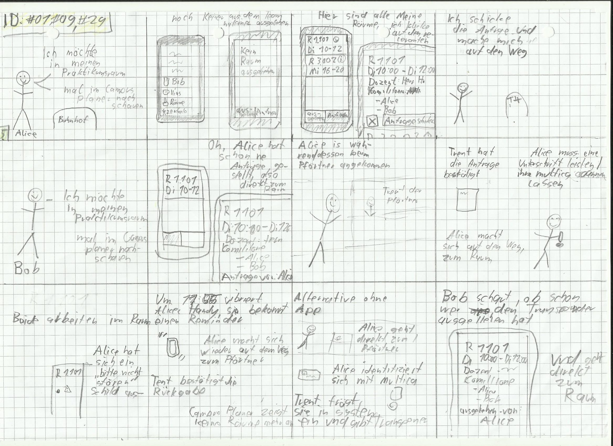
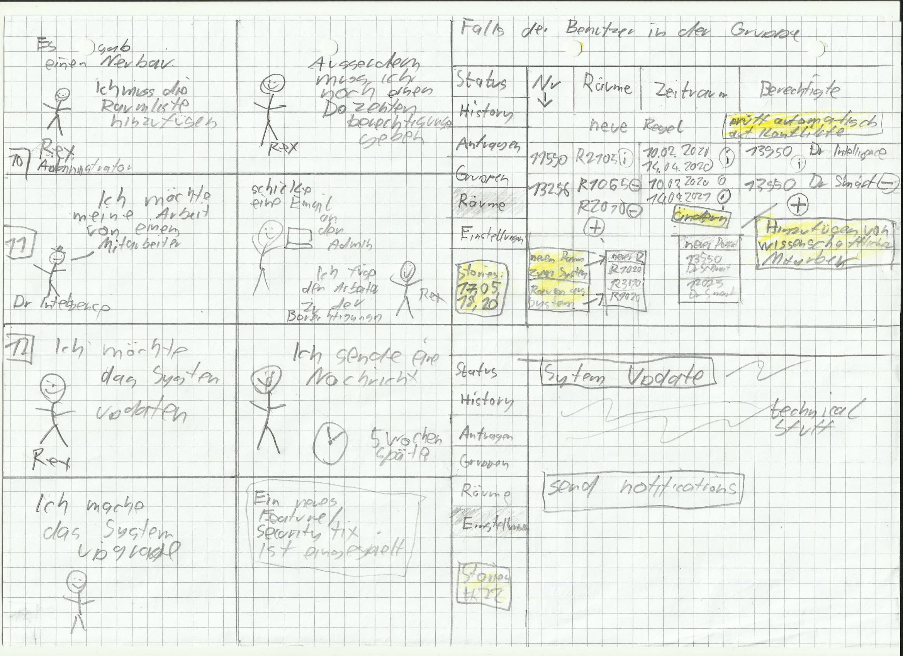
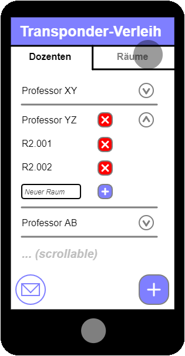
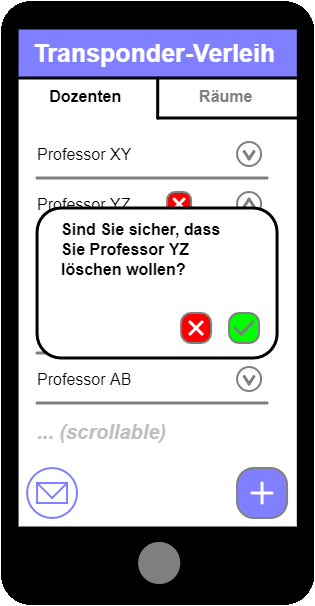
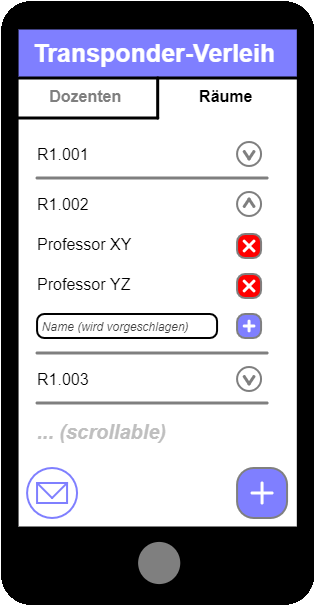

# Einleitung

Dieses Dokument gliedert sich nach den Artefakten des Praktikums. Ab
Meilenstein 2 werden die vorhandenen Artefakte auf Basis von Feedback
und Evaluationen überarbeitet.

Was in den jeweiligen Abschnitten zu erbringen ist, wird immer über
*\[Platzhalter\]* gekennzeichnet. Hierbei gibt es zwei Arten von
Kennzeichnungen:

### *\[Artefakt/e\]*

Platzhalter für das jeweilige Artefakt welches es anzufertigen bzw. zu
überarbeiten gilt z.B. Personas.

### *\[Erläuterung\]*

Platzhalter für eine Erläuterung des jeweiligen Artefakts. Hierbei ist
keine Erläuterung der Methode oder Technik gemeint, sondern vielmehr
eine Begründung von Entscheidungen. Warum wurden ausgerechnet diese
Personas erstellt? Warum sind Elemente im Wireframe wie im Artefakt
ersichtlich angeordnet?\
Dieser Punkt ist essenziell für das Bewertungskriterium „Dokumentation".
Der wichtigste Anhaltspunkt ist hierbei das Feedback seitens
Praktikumsbetreuer und im Review.

**Sie schreiben in Schwarz!**

# Szenario

Nach Ihrem erfolgreichen Studium sind Sie Mitarbeiter/-in der
Softwareschmiede \"Best Practice GmbH\". Ihr Unternehmen konzentriert
sich auf maßgeschneiderte Softwarelösungen und die Digitalisierung von
Arbeitsprozessen.

Das neueste Projekt, welches gleichzeitig Ihren Einstieg in den
Geschäftsalltag darstellt, erhielt Ihr Unternehmen durch die
\"TH-Köln\".

Am Campus Gummersbach ist es mit entsprechenden Berechtigungen möglich,
Transponder zum Öffnen von Räumen auszuleihen. Der Prozess zum
Ausleihen, dem Prüfen von Berechtigungen, als auch dem Verleihen von
Berechtigungen erfolgt dabei rein auf ausgedruckten Listen.

Die Raumverantwortlichen übermitteln hierzu Berechtigungen an die
Pforte. Hier führen die Mitarbeiter/-innen an der Pforte eine Liste mit
allen Schlüsseln und den dazugehörigen Personen, die die Berechtigung
zum Ausleihen eines Transponders besitzen. Ein Transponder kann dabei
mehrere Räume öffnen. Möchte eine Person nun einen Transponder
ausleihen, ist es durch die Mitarbeiter/-innen an der Pforte notwendig,
die Person und seine entsprechende Berechtigung in den entsprechenden
Listen zu überprüfen. Besitzt diese Person die entsprechende
Berechtigung, trägt sie sich mit Datum, Uhrzeit und Namen in eine
Verleihliste ein.

Die aktuelle Handhabung ist sehr pflege-intensiv und widerspricht den
Leitkriterien guter Usability nach DIN ISO 9241-11: Effektivität,
Effizienz und Zufriedenheit.

Ihre Aufgabe ist es, den Transponderverleih der TH Köln am Campus
Gummersbach zu optimieren. Hierzu entwickeln Sie im Laufe des Projekts
ein Konzept, welches sie prototypisch implementieren und testen.

# Spezifikation

Im folgenden ist die eigene Spezifikation zu lesen

## Nutzungskontext verstehen und beschreiben

Im folgenden Bereich ist der Nutzungskontext aufgefuehrt

### Stakeholder Analyse

__**Changelog**__

 **Datum** | **Was wurde geändert?** | **Warum wurde es geändert?** 
-----------|-------------------------|------------------------------
10.5.2020  | initial commit          | damit es da ist                             
01.6.2020  | Various small things    | suggestions got from the first iteration
           |                         |                              
           |                         |                              
           |                         |                              

__***\[Artefakt/e\]***__

$~$

__**Ausleihender  - primary stakeholder**__  

__Ziele__

möchte schnell und einfach in für ihn relevanten Räumen arbeiten können. 

__Einstellung zum Projekt:__

positiv

__Einfluss des Stakeholders:__

direkt (niedrig) - verwendet das System selten

__Impact/Machteinfluss:__

niedrig - keinen Einfluss

---

__**Pförtner - primary stakeholder**__

__Ziele:__

Er möchte Transponder ausleihen und über den Status aller Transponder informiert werden.

__Einstellung zum Projekt:__

positiv

__Einfluss des Stakeholders:__

direkt (hoch) - verwendet System Tagtaeglich

__Impact/Machteinfluss:__

hoch - Initiator und dadurch hohen Einfluss

---

__**technik ablehnender Pförtner - Antiuser**__

__Ziele:__

Möchte, das alles so bleibt wie es ist da nur er das aktuelle System versteht und er dadurch eine gesicherte Stelle hat

__Einstellung zum Projekt:__

negativ

__Einfluss des Stakeholders:__

direkt (mittel) - verwendet das system etwas weniger wenn er es nicht mag

__Impact/Machteinfluss:__

mittel - legt vielleicht beschwerden ein.

---

__**Raumverantwortlicher - primary stakeholder**__

__Ziele:__

Verwaltet Zugriff auf die ihn zugewiesenen Räume.
Sort dafür, das sie immer in einem guten Zustand sind.

__Einstellung zum Projekt:__

positiv

__Einfluss des Stakeholders:__

direkt (hoch) - verwendet das system regelmaessig und direkt

__Impact/Machteinfluss:__

mittel - wichtiger kunde, aber kein geldgeber.

---

__**Administrator - primary stakeholder**__ 

__Ziele:__

Wartet fertiges System,
sowie Räume und Verantwortlicher.
Sorgt dafür, das das System sicher und stabil läuft

__Einstellung zum Projekt:__

neutral

__Einfluss des Stakeholders:__

direkt (mittel) - verwendet das finale System, aber nicht intensiv

__Impact/Machteinfluss:__

mittel - hat vermutlich einen einfluss ob es spaeter angenommen wird

---

__**Auftraggeber - primary stakeholder**__

__Ziele:__

Will die TH-Koeln moeglichst kosteneffizient effizienter machen

__Einstellung zum Projekt:__

positiv

__Einfluss des Stakeholders:__

direkt (niedrig) - verwendet nicht das finale System

__Impact/Machteinfluss:__

hoch - er gibt das geld

__***\[Erläuterung\]***__

$~$

Die hier dargestellten primären Stakeholder sind die hauptsächlichen Nutzer des Systems. 
Diese sind die Personen, welche tagtäglich mit dem System in Berührung kommen werden und damit am wichtigsten fuer uns sind.
Das gemeinsame Ziel dieser ist es, das bestehende System effizienter zu machen.

Die hier dargestellten Anti-User haben dabei eher eine kleinen Einfluss.
Deswegen werden wir vor allem auf die Stakeholder Ausleihender, Pförtner, Raumverantwortlicher und Administrator eingegehen.

### User Profiles  

__**Changelog**__

[//]: # "https://tableconvert.com/"

 **Datum** | **Was wurde geändert?** | **Warum wurde es geändert?** 
-----------|-------------------------|------------------------------
10.5.2020  | initial commit          | damit es da ist                             
01.6.2020  | Various small things    | suggestions got from feedback of the first iteration
           |                         |                              
           |                         |                              
           |                         |                              

__***\[Artefakt/e\]***__

$~$

___Student___

alter: 16-99

__Charakteristiken__

Sind meistens jung (16-30) und haben daher meist niedrigeres Einkommen.
Sind meistens per E-Mail oder Telefon gut erreichbar.
Haben einen hohen Anspruch an Usability da sie viele Apps verwenden.

__Kenntnisse__

- Sehr affin mit Mobile-Apps.
- Sehr affin mit Websites.
- Affin mit Desktop-Applikationen.
- Teilweise keine Erfahrung mit dem Ausleihe-Verfahren.

__Motivation__

Da Studenten oft Transponder für Praktika und Projekte ausleihen müssen, brauchen sie hier eine bessere und schnellere Lösung.
Außerdem sind Studenten viel unterwegs, deswegen bietet sich hier eine Mobile-App an.
Des Weiteren gibt es Studenten, die den Ablauf nicht kennen. Daher braucht man ein interaktives Tutorial für den ersten
Gebrauch.

---

___Pförtner___

alter: 25-65

__Charakteristiken__

Sind meistens im Job immer erreichbar.
Sind meistens affin mit Sicherheits-/Überwachungssystemen und haben generell technische Kompetenz.
Sie wechseln selten den Standort.

__Kenntnisse__

Arbeiten hauptberuflich und sind so meistens erfahren mit ähnlicher Software. 
Sind meistens affin mit apps und handys.

__Motivation__

Da dies eine regelmäßige Tätigkeit ist, hat der Pförtner sehr starkes Interesse an einer effektiveren Lösung.
Aufgrund des festen Standorts bietet sich eine Desktop- oder Webapplikation an.
Moeglich ist aber auch eine Ablehnung von Neuerungen anhand der Gewohnheit an das alte System.
Auch eine Ablehnung aufgrund der Jobsicherheit ist moeglich.

---

___Dozent___

alter: 30-65

__Charakteristiken__

Sind meistens sehr gut per E-Mail erreichbar, auch außerhalb der Arbeitszeiten.
Haben meistens wenig Zeit.

__Kenntnisse__

Haben meistens wenig bis gute Technikkenntnisse mit Mobile-apps

__Motivation__

Aufgrund der wenigen Zeit ist es für Dozenten sehr ansprechend, einen schnelleren und simpleren Prozess zu haben.
Da Dozenten oft noch Mitarbeiter haben, brauchen sie Funktionen zum Delegieren.

---

___Administratoren___

Alter: 25-45

__Charakteristiken__

Sind meistens sehr gut per E-Mail und Telefon erreichbar.
Arbeiten meist privat mit ähnlicher Technik.
Haben meist durchschnittlich viel Zeit.
Kommen aus der Technik-Branche.

__Kenntnisse__

Sind meistens sehr affin mit Mobile-Apps.
Sind meistens sehr affin mit Websites.
Sind meistens affin mit Desktop-applications.
Insgesamt sehr versiert im technischen Bereich.

__Motivation__

Der Administrator arbeitet tagtäglich mit der Software, deswegen ist eine schneller, simplerer Prozess als zurzeit zu bevorzugen.
Außerdem will er eine strukturierte Verwaltung sicherstellen, sodass er seinen Job besser erledigen kann.
Hat eventuell einen geringeren Anspruch an usability als andere Nutzer, hingegen legt er Wert auf Authentifizierung und
umfangreiche Funtkionalität.
Moeglich ist aber auch eine Ablehnung von Neuerungen anhand der Gewohnheit an das alte System.
Auch eine Ablehnung aufgrund der Jobsicherheit ist moeglich.

---

__Auftragsgeber__

Alter: 40-65

__Charakteristiken__

Ist sehr um die Effizient und die 

__Kenntnisse__

spielen keine Rolle da kein Enduser

__Motivation__

Moechte Kosten dauerhaft mit diesem Investment sparen und Effizient erhoehen

__***\[Erläuterung\]***__  

$~$

Diese User Profiles beschreiben die Benutzer, die hauptsächlich mit unseren System arbeiten müssen.

### Personas  

__**Changelog**__  

[//]: # "https://tableconvert.com/"

 **Datum** | **Was wurde geändert?** | **Warum wurde es geändert?** 
-----------|-------------------------|------------------------------
10.5.2020  | initial commit          | damit es da ist                             
           |                         |                              
           |                         |                              
           |                         |                              
           |                         |                              

__***\[Artefakt/e\]***__

$~$

___Moe, die studentische Hilfskraft (Student)___

Moe ist eine studentische Hilfskraft an der TH-Köln, er verwaltet die Zugangsrechte der Studierenden, die im Moment an Projekten
arbeiten. Er selbst hat bereits eine Projektarbeit absolviert, deshalb kennt er sich mit den Bedürfnissen der Studenten sehr gut aus.

Rückblickend findet er gut, dass sein Team damals einen festen Raum zur Verfügung hatte, da sie dort mit Geräten/Lizenzen der TH arbeiten konnten.

Allerdings war das Ausleihen des entsprechenden Transponders oft ein Problem, da der Prozess sehr langwierig war. Er meint, dass das unter anderem daran lag,
dass die Pförtner die Berechtigungen jedes Mal in einem Dokument am PC nachschlagen und danach den Transponder anhand einer Nummer suchen
mussten. Gerade bei neuen Mitarbeitern dauere das Ausleihen besonders lange, da diese noch nicht so viel Erfahrung hatten. Außerdem
musste jeder Transponder bei dem Ausleihen in einem Buch protokolliert werden und bei der Rückgabe quittiert werden. Deshalb empfand Moe den
Prozess oft als störend und anstrengend.

Ein weiteres Problem war für ihn und sein Team, dass das sie nicht wussten, ob sich schon jemand im Raum befindet, was bedeutete, dass sie
oft zum Pförtner liefen, obwohl es gar nicht nötig war.

Auch denkt Moe, dass das aktuelle System zur Konfiguration der Transponder nicht optimal ist, da es zu Überschneidungen bei der Ausleihe kommen
kann. Deshalb musste Moe teilweise zu Leuten gehen, die nichts damit zu tun hatten, damit diese Räume auf oder zu schließen können. Das war
unangenehm für Moe, weswegen er sich eine einfachere Lösung wünscht.

Ebenso fand er es komisch, wenn er andere Studierende, welche ebenfalls auf der Suche waren, aus dem Raum hinauswerfen musste. Aber er 
war schließlich für die Ordnung im Raum verantwortlich.

---

___Erika Musterfrau und Max Mustermann (Student)___

Erika Musterfrau und Max Mustermann sind Informatik Studenten im fünften Semester und nehmen an einem Projekt teil, bei dem Sie auf einen
Transponder angewiesen sind. 

Beim Ausleihen kam es jedoch zu mehreren Problemen. Die E-Mail mit den Berechtigungen kam beim Pförter nicht an. Also musste bei Oliver Simpson
angerufen werden um die Berechtigung nachträglich zu holen, was den Beiden unnötige Zeit gekostet hat. 

Auch hat den beiden Zeit gekostet, dass der Transponder den sie ausleihen möchten, schon verliehen war. Also musste nochmal bei Oliver Simpson 
angerufen werden um eine Berechtigung für einen anderen Transponder zu holen.

Das letzte Problem der beiden war, dass die Abgabe des Transponders nicht genau besprochen wurde. Dadurch haben sie Zeit verschwendet um
auf den Pförtner zu warten.

Ihnen würde es Helfen, wenn die Verwaltung der Transponder zentral ablaufen würde. 

---

___Frau Zelador (Pförtner)___

Als Frau Zelador davon hörte, dass Rex der System-Administrator sich für ein besseres Verwaltungssystem der Transponder aussprach, fielen ihr augenblicklich ein duzend Mängel am aktuellen Ausleihverfahren ein.
Oft ist das Problem fehlende Kommunikation zwischen allen Beteiligten.
Dann kommt es dazu dass viel Zeit vergeht und Studenten nicht an ihre Berechtigungen kommen.

Besonders erinnert sie sich an den einen Morgen, als zwei Studenten vor meiner Pforte standen und um einen Transponder baten, für den sie angeblich berechtigt seien, es laut Liste allerdings nicht waren. 
Erst nach einem Anruf bei Herrn Simpson – der die Mail nur an Frau Zeladors krankgeschriebenen Kollegen gemailt hatte – und einem Griff ins Postfach konnte sie die Liste manuell bearbeiten.
Nun haben die Studenten zwar ihre Berechtigung, allerdings fehlte entsprechender Schlüssel. 
Nachdem sie die Liste zurückgesetzt hatte stellte sie fest, dass bereits jemand anderes den Raum seit ein paar Stunden belegte. 
Eine erneute Rücksprache mit Herrn Simpson war nötig, um zu erfahren, dass es sich um einen Fehler gehandelt habe und auch dieser Student eine Erlaubnis hatte, allerdings von einem anderen Dozenten.

Es passiert ziemlich oft, dass sie Studenten aus ein und demselben Team erklären musste, dass einer ihrer Gruppenmitglieder bereits bei ihr war. 
Sie erwartet von einem neuen System, dass eine klare Kommunikation zwischen ihr und den Dozenten untereinander besteht und Einträge nicht mehr von Hand erfasst werden müssen und aufgrund inkonsistenter Daten überschneidet. 
Außerdem sollen Studenten die Möglichkeit besitzen, online über die Verfügbarkeit ihres Transponders bescheid zu wissen, um unnötige Wege zur Pforte vermeiden zu können

---

___Oliver Simpson (wissenschaftlicher Mitarbeiter)___

Oliver Simpson ist wissenschaftlicher Mitarbeiter im KI-Labor des Campus Gummersbach und muss daher oft die Berechtigung für die Transpondervergabe erteilen.
Er kennt die Seite des Studenten, und wie nervig es sein kann, nicht rechtzeitig in den Raum zu können und deshalb wertvolle Arbeitszeit zu verlieren.
Daher ist es im besonders wichtig, das Missverständnisse hinsichtlich der Ausgabe nicht vorkommen und versucht daher die Daten möglichst aktuell zu bleiben.

Oliver fehlt dabei besonders eine zentrale Verwaltung der Transponder. 
Dies würde die Berechtigungsliste immer aktuell halten.
Das würde auch Fehler vermeiden, wo durch Fehlen bestimmter Personen Missverständnisse auftreten.

---

___Pr Dr Intelligence (Dozent)___

Seid 5 Jahren doziere ich an der Th-Köln. 
Um meinen Lehre praxisbezogener zu machen, lasse ich meine Studenten Praktika machen.
Da sie für diese spezielle Software brauchen, müssen sie diese in Räumen der TH-Köln machen.

Hierfür stehen mir 3 Räume zur Verfügung. 
Diese kann ich dann über den Pförtner an meine Studenten verleihen.
Das geht mittlerweile schnell, vor allem seit ich mich mit im gut verstehe.

Am Anfang war das allerdings schwieriger. 
Der Ablauf ist nicht trivial und ich musste mir beim ersten Mal helfen lassen.
Deswegen dauerte es die ersten Male auch länger und selbst jetzt geht es nicht in der gewünschen Zeit
Das ist besonders störend, da meine Zeit zum Forschen schon vorher begrenzt war.
Lieber würde ich die Transponderverleihung an einen mir untergeordneten Mitarbeiter abgeben.

Außerdem ist es mir schon vorgekommen, das ich zwei gruppen aus Versehen den gleichen Raum ausgeliehen habe.
Dies geschah, weil mir der Überblick dazu fehlte.
Ich wünschte es gäbe ein System, was dies vermeiden würde.

Ab und an passiert es auch, das eine Gruppe den Raum nicht anständig verlässt.
Dies ist besonders anstrengend, da oft keiner sich schuldig fühlt und ich dann keinen Ansprechpartner finde.

---

___Rex (Administrator)___

Rex ist seit etwa 11 Monaten an der TH Köln in Gummersbach in einem Team als System-Administrator beschäftigt und unter anderem für die Verwaltung der Transponder-Schlüssel verantwortlich. Dies hat ihn allein in dieser kurzen Zeit schon viel Mühe gekostet, da er sich die meiste Zeit mit Überschneidungen zwischen Transpondern kümmern muss.
Eigentlich ist seine Aufgabe, neue Räume in Neubauten zu erschließen und mit Transpondern zu versehen, doch verursacht das aktuelle System zur Verwaltung und Vergabe der Schlüssel viele Probleme, die einfach zu vermeiden wären.

Rex wünscht sich ein stabileres System, welches im in den kommenden Jahre viel Zeit sparen könnte. Das System müsste eine funktionierende Kommunikation zwischen Dozenten, Pförtnern und Studenten gewährleisten und dabei leicht für Rex zu verwalten sein.
Er hätte dann die Möglichkeit, Dozenten hinzuzufügen, zu bearbeiten und wieder zu löschen. Darüber hinaus kann er die Benutzer des Systems Benachrichtigen, beispielsweise bei einem Netzausfall.

__***\[Erläuterung\]***__

$~$

Wir schreiben Personas für die im Vornhinein als wichtigsten ausgemachtesten Userprofiles. 
Hierdurch werden die Bedürfnisse, Probleme und Erwartungen klarer, wodurch wir unsere Produkt später preziser auf diese Gruppen entwickeln können.

Außerdem ist uns dadurch klar geworden, wie unterschiedlich die einzelnen Personas sind.
Auch dies hilft dadurch, uns ein besseres Bild von den finalen Nutzer zu machen.

Wichtig war dabei, das wir je User-Profile mehr als eine Persona bauen.
Das hilft dabei, mehr unterschiedliche Perspektiven auf ein Thema zu haben

## Nutzungsanforderungen spezifizieren

User Storys: https://agile02.gm.fh-koeln.de/pages/viewpage.action?pageId=19464219

Ist-Szenarien: https://agile02.gm.fh-koeln.de/display/MCIP/Ist-Szenarien

## Gestaltungslösungen entwickeln, die die Nutzungsanforderungen erfüllen

Im folgenden sind die individuellen Gestalltungsloesungen aufgefuehrt.

### Storyboards

__**Changelog**__

[//]: # "https://tableconvert.com/"

 **Datum** | **Was wurde geändert?** | **Warum wurde es geändert?** 
-----------|-------------------------|------------------------------
10.5.2020  | initial commit          | 
15.05.2020 | [Anmerkungen baabt](https://github.com/BaAbt/mci/commit/18a7dcae925916f70122b879feae2f1b1aa90938) | Anmerkungen zum Feedback
08.06.2020 | Anmerkungen Jannik Alexander | Erläuterungen zum Storyboard 
08.06.2020 | Aktualisierungen Storyboards | Anpassung auf Basis der Vorschlaege
           |                         |                              
           |                         |                              
           |                         |                              

__***\[Artefakte\]***__

$~$

\newpage

BaAbt - Storyboards in keiner spezieller Ordnung,
da alle inneinander greifen.
Berechtigungen werden über zentrale TH-Rollen geregelt.

__Anmerkungen__

- Oben links, Papier abgerissen. Text sollte eigentlich heisen 'falls der User' und bezieht sich auf das Rechtesystem der TH.
- Ich habe es vergessen aufzuschreiben aber die die Authentifizierung und Authorisierung der Anfragen erfolgt ueber den Campus Planer erfolgt.
  Das bedeutet die Anfragen sind alle berechtigt, da nur Raeume angefragt werden koennen, fuer die der Auszuleihende berechtigt ist.
  Dieses ganze Anfragesystem dient also dazu, den eigentlichen Ablauf beim Pfoertner etwas zu minimieren und besseren Ueberblick zu schaffen.
- Spam ist hierbei auch nicht die grosse Gefahr, da 
  - die Anfragen berechtigt sein muessen und man somit auch fehlverhalten bestraffen kann
  - die Anfrage liste ja sortierbar und mit strg-f suchbar ist. 
  - alte Anfragen automatisch geloescht werden.
- zu den Fragen warum mehr Informationen: 
  Warum nicht, mehr Infos sind immer hilfreich um den Kontext besser zu verstehen und moeglichweise Konflikte zu loesen.
- Warum nicht Verstoesse automatisch mitteilen: es teilt doch alle Verstosse mit, in dem es sie einfaerbt.
- Pannel 3 zeigt nur den Ablauf ohne Anfrage. Hier muessen halt die per Hand eingetragen werden. 
  Die software hilft dabei indem sie die Optionen abhaengig von den Berechtigungen einschraenkt.
- Panel 4 zeigt, was passiert wenn das System selbst down war und deshalb der Status nachgetragen werden muss.
- Eine Web-Anwendung ist etwas anderes als eine Excel-sheet und kann durchaus interactive elemente enthalten. 
  Und ja, Buttons gibt es in zahlreichen Web-Anwendungen die eine tabulaerre Darstellung nutzen. 
  Beispiel: ihr email-client.

__Anmerkungen__

- Naja das _Feature_ das ich hier extra einbaue ist das auch die Studenten sehen koennen falls wer anderes ne Anfrage geschickt hat.
  Und ob das extra Aufwand ist wage ich zu bezweifeln
- klar die push notification bei Zeitablauf ist unnoetig und wird entfernt.
  Das war ein Wunschdenken als Student :)
- Bob kann keine Anfrage stellen wenn fuer den Raum schon eine existiert. 
- beim Manuellen Nachtragen muss Trant die Gruppe, den Verantwortlichen, und den Transponder eintragen.

__Anmerkungen__

- NR = Transpondernummer.
- das der campus um 11 dicht macht wusste ich nicht, damit ist das natuerlich noch besser und kann dementsprechend geaendert werden.
- Die Darstellung der History zum Status weicht ab, da Unterschiedliche Informationen dargelegt werden
  Status - Wann wurde es aus geliehen und bis wann ist die Person berechtigt.
  History - Was war der komplette Ausleihezeitraum und was war der berechtigte.
- zum hinzufuegen siehe Hinzufuegpannel des Admin
- Immer der verantwortliche gibt den Transponder wiede ab.
- wenn man wen einschließt ist der eingeschlossen :). Das hat aber nichts mit dem System zu tun

__Anmerkungen__

- User Story 21 findet sich auch in dem Pannel 10/11. 
Dies ist genauso wie beim raum geloest, so dass eine Liste von existierenden Dozenten darliegen und dazu zusaetzlich eine Moeglichkeit zum hinzufuegen existiert.
- User Story 22 dachte ich findet sich im `send Notiication` Button.
Dieser wuerde ein Pannel wie bei allen gewohnten Seiten (gitlab, nextcloud) hervorrufen.
Dieses habe ich allerdings nicht gemalt, da ich zu faul war. 
Stell dir einfach ein fettes gelbes banner oben auf der website/app vor (oder schreib mir nochmal dann mal ichs auf).
- Die Trennung von Raeumen und Transpondern wurde extra nicht nachgenommen, da es eigentlich nicht im Interesse des Admin ist, Raeume zu verwalten die nicht von Transpondern genutzt werden
Falls ein zentrales Raummanagment der TH existiert kann man hier noch mal drueber nachdenken.
Da fehlen aber eindeutig die Informationen zu, genau wie zu dem bestehenden Rechtesystem/Verwaltungssystem.
- als Admin moechte man doch volle Kontrolle ueber alle Berechtigten Raumverantwortlichen haben.
Dazu zaehlt, das kein verrueckter Professor irgendwelchen Leuten Berechtigungen erteilen kann.
Also muss es mindestens einen Prozess des Approvals geben, und da ich denke das nicht alle Profs dieses Feature ueberhaupt nutzten, habe ich die Sache vereinfacht.

\newpage

$~$

__Anmerkungen__

In diesem Storyboard sieht man, dass ein Student einfach den Status seiner Transponder sehen kann (User Story #29)

{ height=80% }

__Anmerkungen__

Rückblickend ist dieses Storyboard nicht nötig, da es nicht in einer User Story erwähnt wurde.

{ height=80% }

__Anmerkungen__

In folgendem Storyboard wird gezeigt wie ein Dozent eine Zugangsberechtigung erteilt. (User Story #08 & #16)

{ height=80% }

{ height=80% }

__Anmerkungen__

Dieses Storyboard zeigt, wie ein Dozent seine Arbeit an ein neues Teammitglied delegieren kann (User Story #17)

{ height=80% }

{ height=80% }

__Anmerkungen__

Im folgenden Storyboard sieht man, wie ein Dozent Studierenden eine Berechtigung entziehen kann (User Story #10)

{ height=80% }

__Anmerkungen__

In den folgenden zwei Frames sieht man, wie der Pförtner die sich in der Ausleihe befindlichen Transponder überprüfen kann (User Story #02 & #03), er sieht auch, wie lange diese Schon ausgeliehen sind (User Story #07). Desweiteren kann er durch das betätigen des Berechtigung anzeigen Buttons sich alle mit dem Transponder assoziierten Räume ausgeben lassen (User Story #04)

{ height=80% }

__Anmerkung__

Hier kann der Pförtner einsehen ob eine Person berechtigt ist (User Story #06), verifikation erfolgt über die MultiCA (User Story #28), er kann dann direkt auf einen kleinen Button klicken um eine Ausgabe vorzubereiten, der Student muss dann nur noch Unterschreiben (entweder auf einem elektronischen Tablet, oder wenn das nicht geht halt auf Papier, was aber den sinn einer Applikation kaputt machen würde) und dann kann der Pförtner auf Ausgabe klicken um den Transponderstatus zu ändern. (User Stories # 01, 27) Bei einem Systemausfall kann der Pförtner einfach die Daten manuell in dem Tab ausgabe Eingeben, den Rest erledigt das lokale System (User Story #26)

{ height=80% }

__Anmerkungen__

Hier kann der Admin alle Dozenten sehen und löschen (User Story #20) neue Räume werden dadurch hinzugefügt, dass sie entweder bei einem Professor oder einem Transponder verlinkt werden, da es sonst keiner weiterer infos bedarf als einer Nummer. (User Story #)

{ height=80% }

{ height=80% }

\newpage

$~$

\newpage

$~$

\newpage

$~$

### Figma Prototyp

__**Changelog**__

[//]: # "https://tableconvert.com/"

 **Datum** | **Was wurde geändert?** | **Warum wurde es geändert?** 
-----------|-------------------------|------------------------------
           |                         |                              
           |                         |                              
           |                         |                              
           |                         |                              
           |                         |                              

__***\[Artefakt/e\]***__

[https://www.figma.com/file/buzQVswf0Y6DTCi9UF5fkY/Transponderapp?node-id=75%3A2461](https://www.figma.com/file/buzQVswf0Y6DTCi9UF5fkY/Transponderapp?node-id=75%3A2461)

__***\[Erläuterung\]***__

**Allgemein**

Im Verlauf des Praktikums kam die Frage auf ob man die Zuweisung von Räumen auf Transpondern automatisieren kann. Aufgrund der aktuellen Lage kann dies allerdings nicht nachgeforscht werden. Gleichzeitig würden wir jedoch gerne diesen Ansatz weiterverfolgen und gehen daher von einem Szenario aus, in dem das möglich ist.

Die Zuweisung von Transpondern und Räumen findet dabei bei uns automatisch beim Ausleih statt. Dabei werden die Räume, auf die ein Student Zugriff hat einen Transponder zugewiesen, welcher dann ausgeliehen wird. Wenn der Transponder zurückgegeben wird (oder nach 11 Uhr abends) werden automatisch alle Zuweisungen von den Transponder gelöscht.

Dies hat mehrere Vorteile:

- Konflikte zwischen Transpondern werden vermieden.

- weniger Arbeit für den Pförtner und Administrator

- keine Sicherheitslücken von Transpondern mit zu großen Berechtigungen.

Als Zeitdarstellungen wird ein intuitives System verwendet, welches automatisch “gestern” oder “2 Minuten” anstelle von Daten eingefügt. Dies erleichtert die Lesbarkeit bei Daten ungemein.

**Student**

Beim Studenten haben wir uns für eine App entschieden, da dieser auch auf dem Weg zur Uni nachschauen möchte ob der Transponder für den Raum ausgeliehen ist. Dabei wird dem Studenten nur einen Menüpunkt angezeigt. Ein Menü wird trotzdem verwendet, um zukünftigen Featuren Platz zu geben.

 In dem Punkt Berechtigungen hat der Student dann eine Auflistung all seiner Berechtigungen. Wir haben uns dafür entschieden ihm direkt zu zeigen ob der Raum belegt ist und bis wann er noch die Berechtigung für den Raum hat, da dies für ihn die wichtigen Informationen sind. Wenn der Student noch mehr Informationen braucht, soll er einfach auf das Element klicken. Da uns diese aber nicht so wichtig erschienen sieht man diese nicht direkt. Außerdem verfügt er über die Möglichkeit zu Suchen um bei einer Menge an Berechtigung auch schnell die nötigen Infos zu bekommen.

**Dozent**

Auch bei den Mitarbeitern haben wir uns für eine App fürs Smartphone entschieden, da sie wie die Studenten sehr mobil sind und auch unterwegs die Möglichkeit haben wollen, Management Aufgaben erledigen zu können. Im Menü werden ihnen ihre drei wichtigen Funktionen angezeigt. Unter _Students _werden den Mitarbeiter alle Studenten (später in alphabetischer Reihenfolge) angezeigt, welche an ihren Vorlesungen teilnehmen. Er kann die Studenten nach einem Namen durchsuchen, um schnell eine Person zu finden. Die Studenten werden automatisch mithilfe einer API der Liste auf dem aktuellen Stand gehalten. 

Bei der Liste haben wir uns für zwei unterschiedliche Touch-Möglichkeiten entschieden, um das Design übersichtlich zu gestalten. Wenn der User nur kurz auf den Listeneintrag tippt, wird er zu dem Profil des jeweiligen Studenten weitergeleitet. Wenn er dagegen lange auf einen Eintrag drückt, wird dieses Element markiert und er kann weitere Elemente auswählen. Da diese Geste in vielen Applikationen verwendet wird, sollte der User mit dieser Funktionsweise bereits  vertraut sein. In dem Profil eines Studenten zeigen wir die wichtigsten Informationen und man kann den User Stories entsprechend einem Studenten die Berechtigung entziehen und erteilen. Beim Entziehen von Berechtigungen haben wir eine Liste gewählt, um es übersichtlich zu gestalten. Um die Möglichkeit zu verdeutlichen, dass der User mehrere Einträge einer Liste auswählen kann, haben wir bei all unseren Listen, bei denen dies möglich ist, mehrere Boxen mit Häkchen versehen. Wir haben auf jedem Profil jeweils einen Button für das Entziehen und das Hinzufügen von Berechtigungen eingefügt, da das der Hauptgrund des Users sein wird, auf ein bestimmtes Profil zu drücken. Dabei haben wir uns für die Farben Rot und Blau entschieden, da diese gut die Gegensätzlichkeit der beiden Optionen darstellen. Gleichzeitig wirken sie dabei aber seriöser als Rot und Grün.

Beim Prozess des Vergebens und Entziehens von Berechtigungen haben wir versucht, die beiden Abläufe so ähnlich wie möglich zu gestalten, um dem User den Lerneffekt zu erleichtern. Desweiteren haben wir uns dazu entschieden dem User nach seiner Auswahl von Studenten und Räumen den Zwischenstand zu präsentieren, damit er nicht erst anschließend bemerkt, ob er alles richtig gemacht hat. Außerdem hat er dabei die Möglichkeit, den Zeitraum für die Berechtigung zu setzen und einen Timeslot auszuwählen. Dazu haben wir einen Kalender simuliert um dem User den Input zu erleichtern und den Prozess besonders interaktiv zu gestalten. Durch die Visualisierung der Timeslots sieht er auch, welche Räume bereits belegt sind und kann dadurch Überschneidungen vermeiden.

Eine weitere Funktion der App wird sein, dass ein Dozent seine Arbeit auch delegieren kann, indem er Personen zu seinem Team hinzufügt. Dabei wurde das Design von den Studenten weitergeführt, um konsistent zu bleiben und den User nicht zu verwirren. Zusätzlich wird dem Nutzer ein Prompt angezeigt, sobald er Änderungen am Team vornimmt, um ungewollte Modifikationen zu verhindern.

Die Menüoption Rooms sieht den vorigen Menüpunkten ebenfalls ähnlich, wobei hier statt Profilbildern kleine Icons zur Visualisierung verwendet, damit ~~auch die linke Gehirnhälfte des Users angesprochen wird~~ er dadurch schneller den richtigen Raum findet.

**Admin**

Beim Admin haben wir uns für eine Desktop-Variante entschieden, da dieser Probleme nicht unterwegs lösen muss. Außerdem bietet sich der Desktop eher an als ein Handydisplay, da wir uns hauptsächlich für Listen entschieden haben, um Informationen möglichst übersichtlich darzustellen. Der Admin ist was das angeht sehr an die Benutzeroberfläche des Pförtner angelehnt, wie zum Beispiel die Menüleiste links, dem Add-Button in der rechten, unteren Ecke, sowie den Formularen. Dadurch ist auch zwischen den Anwendungen eine hohe Konsistenz gewahrt. Farblich ist das meiste in schlichtem Grau und Weiß gehalten. Als Akzentfarbe haben wir uns für ein strahlendes Blau entschieden, welches dem Admin die wichtigsten Buttons hervorheben soll und außerdem die einzelnen Tabellenspalten in transparenten Variante voneinander abgrenzt.

**Employee**

Unter Mitarbeiter sieht der Admin alle Personen und deren zugeordneten Räume übersichtlich dargestellt in zwei Spalten. Damit der Admin noch schneller die Liste überschauen kann, gibt es zudem eine Suchfunktion. Falls es in einem Fall mehrere identische Namen gibt, kann auch mit der Mitarbeiter-ID gesucht werden. 

Um einen neuen Mitarbeiter hinzuzufügen, ist unten rechts ein blauer Button, der sich farblich von der Liste abhebt. Wenn eine neue Person hinzugefügt wird, öffnet sich ein Formular, in welchem der Namen des Mitarbeiters eingetragen wird. Die EmployeeID wird automatisch von der Datenbank generiert, um Personen auch weiterhin eindeutig zuordnen zu können, falls zwei Personen denselben Namen besitzen. Räume können nur nacheinander vergeben werden, damit diese anschließend auch wieder einzeln gelöscht werden können. Innerhalb des Formulars kann der Admin den Prozess jederzeit abbrechen, jedoch erst nach Eingabe des Namens und der ID den neuen Benutzer anlegen kann. Ein zugehöriger Raum ist dazu nicht erforderlich.

Um sich weitere Informationen über eine Person anzeigen zu lassen, kann man diesen in der Tabelle anklicken. Das anschließende Fenster besitzt große Ähnlichkeit mit den Formularen zum Anlegen und Bearbeiten von Mitarbeitern. Der einzige Unterschied besteht darin, dass die Eingaben nicht bearbeitet werden können, bevor auf den entsprechenden Knopf in der Bildschirmecke geklickt wurde. Beim Bearbeiten können ähnlich wie beim Hinzufügen der Name geändert werden und einzelne Räume hinzugefügt oder gelöscht werden. Der Button zum Speichern ist erneut farblich hervorgehoben, links daneben ein grauer Button, welcher die aktuellen Änderungen verwirft und weniger Aufmerksamkeit bedarf als das Speichern.

Um jemanden aus dem System zu löschen, befindet sich unten links auf der Seite mit den Informationen zur Person ein auffällig roter Button. Damit man aber nicht versehentlich eine Person unwiderruflich löscht, warnt ein Pop-Up den Admin, wenn er vorhat, jemanden zu löschen. Auf dem Pop-Up gibt es daher einen Button, der die Aktion beendet. Rechts daneben ist der farblich hervorgehobene Löschen-Button.  

**Rooms**

Unter dem Menüpunkt Rooms werden alle im System verwalteten Räume mit Nummer, eine kurzen Beschreibung (Descriptor) und der letzten Benutzung tabellarisch dargestellt, ähnlich wie bei den Mitarbeiter. Die Räume sind nach ihren Nummern sortiert und können auch danach gesucht werden. Zusätzlich kann der Admin im Suchfeld einen Descriptor eingeben, um nach diesem zu filtern.

Bei der Auswahl eines Raumes werden weitere Informationen über diesen angezeigt, wie die berechtigten Mitarbeiter. Wie zuvor beim Mitarbeiter können die Informationen bearbeitet, einzelne Mitarbeiter hinzugefügt oder entfernt werden. Wir haben uns dafür entschieden, dass einzelne Räume nicht wieder aus dem System gelöscht werden können, außer man löscht sie innerhalb der Datenbank. Deswegen gibt es hier keine Möglichkeit, Räume zu löschen.

Dass sowohl Räume Mitarbeitern zugeordnet werden können, sowie andersherum, ist gewollt, um dem Admin maximalen Komfort beim Verwalten des Systems zu bieten.

**Settings**

Unter dem letzten Menüpunkt Settings, kann der Admin die Systemsprache ändern, ein Software-Update zu installieren oder eine Nachricht schreiben. Es gibt zwei Textfelder, die wie beim Schreiben einer E-Mail aufgebaut sind. Die Nachricht kann an alle Benutzer des Systems gesendet werden oder aber an bestimmte Benutzer oder Benutzergruppen. Die Nachricht wird dann einfach im großen Textfeld eingegeben und mit dem blauen Button unten Links verschickt, der im selben Stil der anderen Buttons gehalten ist. Der erfolgreiche Versand der Nachricht wird mit einem Pop-Up-Fenster quittiert.

**Pförtner**

Der Pförtner hat eine Desktop oder Webanwendung mit 4 Unterpunkten.

Es wurde eine grobe Tabellenstruktur gewählt um möglichst viele Informationen übersichtlich zu gestalten. Außerdem kann man die einzelnen Entries ausklappen, welches mehr Details preisgibt. Um das noch übersichtlich zu gestalten wird links an der Tabelle eine kleine Farbige leiste angezeigt. Diese zeigt genau, auf welcher Ebene der Nutzer sich zurzeit befindet.

Farblich wurden ansonsten klare Weiß und Grautöne gewählt, um die wichtigen farbliche Elemente weiter hervorzuheben.

**In Ausleihe**

Das Ziel des Tabs ist es alle relevanten Informationen über die zurzeit im Ausleihe befindenden Transponder zu bekommen. Unter dem Status wird dem Pförtner eine Liste aller zurzeit ausgeliehenen Transponder angezeigt. Ein Listeneintrag enthält dabei die wichtigsten Informationen über den Stand eines Transponder Verleih Prozesses:

- die Nummer des Transponder

- die Person welche diesen ausgeliehen hat

- berechtigten Zeitraum.

Mithilfe dieser Darstellungen ist es leicht zu erfahren, welche Transponder zurzeit ausgeliehen sind und welche Fristen und Zeiten diese beinhalten, um einen guten Überblick über die aktuelle Lage zu vermitteln.

Bei anklicken einer Zeile wird diese noch erweitert, sodass man mehr Informationen über den interessierten ausgeliehenen Transponder erfährt. Diese Ausklapp Struktur wird so verwendet, um relevante Informationen erst bei Bedarf anzuzeigen. Das dropdown Symbol ist dabei aufgrund der häufigen nutzung leicht zu verstehen. Folgende Informationen werden durch Klick auf die Tabelle ersichtlich:

- Alle Berechtigte Personen der Gruppe sowie den zuständigen Verantwortlichen (den man auch direkt per mail anschreiben kann)

- Alle Räume die für diesen Transponder aktuell in Ausgabe stehen.

- Knopf für das Zurückgeben des Transponders

Diese Information helfen dabei mehr Kontext über einen Transponder zu bekommen, sowie den Transponder einfacher zurückgegeben. Das schnelle überarbeiten wird auch unterstützt durch die Suchfunktion, die prominent über der Tabelle platziert wurde. Diese erweitert sich auf Knopfdruck um Filterfunktionen, um bei Bedarf mehr Funktion zu bieten.

Dort ist auch der Knopf für das manuelle Hinzufügen eines Transponders Verleih verlinkt, welcher zum Vergabe Fenster führt. Dieser wurde da platziert um die Navigierbarkeit der Seite zu verbessern.

Zusätzlich werden die Zeilen eingefärbt, um kritische Transponder hervorzuheben.

- Orange, falls die Berechtigte Zeit am gleichen Tag überschritten wurde, als leichte Warnfarbe.

- Rot, falls der Transponder am Ende der Zeit immer noch nicht zurückgegeben wurde, als aggressive Warnfarbe.

**Verlauf**

Das Ziel des Tabs ist es die vergangenen Ausleihen nachvollziehbar und durchsuchbar zu machen.

Diese filtert die Informationen weiter Runter und beschränkt sich in den einzelnen Entries auf die Transponder-Ids, den Zeitraum und die Räume. Meistens wird man im Verlauf schauen, falls der Transponder fehlt oder die Räume schlecht hinterlassen wurden. Dabei hilft der Fokus auf diese Inhalte, falls mehr Informationen gefordert sind kann der Eintrag wieder erweitert werden.

Graphisch wurde hier auf Farben oder hervorhebungen verzichtet, damit die Seite sauber und klar zu verstehen wirkt. Wie in dem In Ausleihe Tab gibt es auch hier eine Suchfunktion, um den Verlauf weiter zu durchsuchen.

Falls das System ausgefallen ist, kann man hier auch über den manual Entry den Verlauf nachtragen.

**Personen**

Das Ziel des Personen-tabs ist es den Transponder Verleih schnell und schmerzlos zu gestalten.

In den Personen werden alle Personen dargestellt und sortierbar gemacht.

Falls eine von diesen jetzt einen Transponder ausleihen will, kann hier nach der Person gesucht werden. diese kann man dann aufklappen und ihre relevanten Timeslots sehen.

Neben dem Timeslot findet sich auch ein Knopf für den schnellen Verleih eines Transponders. Falls dieser gedrückt wird, wird der Nutzer automatisch zu den ausgefüllten Vergabe Fenster weitergeleitet.

Falls die aktuelle Zeit in einem Timeslot oder 30 Minuten vor einem Timeslot fällt, wird dieser Button farbig markiert, um direkt ins Auge zu fallen.

**Vergabe**

Das Ziel des Vergabe-Tabs ist es den tatsächlichen Verleih vorzunehmen.

Diese Möglichkeiten sollen die Software flexible und schnell zu bedienen machen.

Dieses Tab kann durch 3 Weisen aufgerufen werden

- per auflegen der multica auf den Reader

- per Auswahl aus den Personen-tab

- manuell durch die Sidebar

Falls die Multica eines Studenten im System aufgelegt wird und dieser im System ist und die aktuelle Zeit in einem Timeslot oder 30 Minuten vor einem Timeslot fällt,

Wird das Vergabe Feld automatisch mit den richtigen Daten befüllt.

Dasselbe gilt für aus den Personen-tab.

In diesem werden alle notwendigen Felder angegeben werden, die ausgefüllt werden können. Diese Eingabe wird mit dynamischen und voneinander abhängigen Vorschlägen ergänzt, um ein möglichst schnelles und Fehlerfreies ausfüllen zu ermöglichen.

Dynamisch heißt hier, dass die Vorschläge abhängig von den zurzeit eingetippten Dateien sind. Falls zum Beispiel der Anfang eines Namens eingetippt wird, wird automatisch ein Name, der denselben Namen hat vorgeschlagen.

Dieser Vorschlag kann dann mit enter oder tab angenommen werden.

Voneinander abhängig heißt hier, das wenn zum Beispiel nur eine Person mit demselben Namen existiert, wird die Matrikelnummer automatisch ausgefüllt.

Außerdem werden die Räume und das Limit automatisch abhängig von der aktuellen Zeit und den Berechtigungen eingetragen wird.

Dies kann alles aber auch manuell überschrieben werden.

Falls allerdings am Ende nicht die geforderten Rechte da sind, muss bestätigt werden.

Dies wird per eingabe bestätigt um sicher zu gehen das keine falschen Transponder aus versehen verliehen werden.

Außerdem gibt es dort ein Unterschriftenfeld was auf Wunsch per Grafiktablett angesteuert werden kann. Dies kann dann für eine digitale Unterschrift genutzt werden. Allerdings wird diese eigentlich nicht mehr benötigt, da die Autorisierung im besten Fall über die Multica verläuft.

Bei Bestätigung wird dann ein zurzeit nicht ausgeliehener Transponder zufällig ausgewählt und mit den richtigen Berechtigungen beschrieben. Dieser wird dann am Screen groß ausgegeben, sodass der Pförtner diesen nehmen, physisch holen und ausgeben kann.

Falls das System nicht die Datenbank erreichen kann, wird eine Fehlermeldung angegeben, in die automatische findung eines Transponders manuell überschrieben wird.

Der Confirm button wurde dort absichtlich eingeführt und nicht durch klick irgendwo auf der seite ersetzt, um fehlerhaftes confirmen zu vermeiden, bis der transponder auch tatsächlich ausgeliehen wurde.

**Identifizierte Probleme aus dem Review**

[//]: # "https://tableconvert.com/"

 **Datum** | **Was wurde geändert?** | **Warum wurde es geändert?** 
-----------|-------------------------|------------------------------
           |                         |                              
           |                         |                              
           |                         |                              
           |                         |                              
           |                         |                              

[ ]{.underline}

### Funktionaler Prototyp

__**Changelog**__

[//]: # "https://tableconvert.com/"

 **Datum** | **Was wurde geändert?** | **Warum wurde es geändert?** 
-----------|-------------------------|------------------------------
           |   Confirm buttom |   Um Benutzung stabiler und sicherer zu gestalten
 31.07.2020| Bessere und Ausfuehrlichere Erlaeuterung | Fuer mehr Verstaendnis der Applikation
 31.07.2020 | Entferntenung des Abruch-Buttons | Wird nicht vorgesehen                             
 31.07.2020 | Hinzufuegen des Multica einlesen Knopf | gestaltet den Ablauf eingängiger und stabiler hinsichtlich Fehler
 31.07.2020 | Hinzufuegen des Spalte ´Ausgeliehen von´ | weist einer Ausleihe einen festen Verantwortlichen zu.
           |                         |                              
           |                         |                              

__***\[Artefakt/e\]***__

Git Repo unter [https://baabt.github.io/mci](https://baabt.github.io/mci)
Dort sind Anweisungen zum Bau und Link zur Webseite zu finden.

__***\[Erläuterung\]***__

Dies ist leider nicht so ausfuehrlich, wie wir es gerne haetten, sollte allerdings alle Punkte erfuellen.
Man sollte vielleicht erwaehnen das vor dieser Aufgabe keiner aus dem Team Erfahrung mit Frontendentwicklung hatte und die Klausuren sich annaeherten.
Jetzt wo die Entschuldigungen aus dem Weg sind hier die Erlaeuterungen:

__Allgemein:__

- Die Anwendungen wurde mit Typescript und ohne Frameworks entwickelt.
- Sie Arbeitet bei In Ausleihe, Raeume und Verlauf mit einem Internen Array
- Sie arbeitet intern auf einer in der Typescript verwalteten liste

__Zeitslots bei der Ausleihe:__

Unser System verwendet Berechtigungen von Gruppen von Studenten auf Gruppen von Räumen ueber einen gewissen Zeitraum.
Dies ermoeglicht ein sicheres, übersichtliches und vor allem konfliktfreies Zuweisen.
Ohne festen Zeitraum und Raumzuweisung könnte das System nicht eindeutig Konflikte erkennen.
Hierdurch wird auch der Verleih beschleunigt, da nicht darauf geachtet werden muss.
Das Zuweisen von Transpondern geschieht dabei automatisch bei Verleih des Transponders.

__In Ausleihe:__

- Anpassen der Informationen in der collapsed Zeile auf Relevantere Informationen
- Die Ausleihfrist wurde weiterhin uebernommen. Diese ist bei unseren System (Transponderraumzuweisung bei Ausleihe) noetig, um Berechtigungen wieder freizugeben und blockieren. Dadurch hilft sie das ganze System sicherer zu machen.
- Weiterhin warn die App, wenn die Frist eines Transponder abgelaufen ist um das ganze System noch sicherer zu sein
- Die Liste wird nach der Frist sortiert, da diese am wahrscheinlichsten sind um sie wieder zurueckzugeben.
- Bei Zurueckgabe wird nun ein Confirm Meldung eingefuehrt, die das System fehlerressistenter macht
- Das AusklappenSymbol wurde durch ein plus Symbol ersetzt und ein hover effekt wurde eingefuehrt, um die Anklickbarkeit besser erkaehntlich zu machen.
- Das Ausklappen wurde weiterhin uebernommen um clutter zu vermeiden
- Die Hoehe der Zeilen wurde reduziert, um mehr Informationen auf den Bildschirm zu packen. Dies ist auf nen vernuenftigen Bildschirm ohne Probleme moeglich

__Verlauf__

- nur der Vollstaendigkeit hier, wurde nicht gefordert, waere aber sehr einfach zu implementieren

__Raumliste:__

Die Raumliste zeigt alle Räume, ihre Bezeichnung und ob sie belegt sind, an. Bei einem Klick auf einen Raum werden alle assoziierten Transponder angezeigt. Diese werden nicht schon in der Übersicht angezeigt um mehrere Räume gleichzeitig auf dem Bildschirm darzustellen.

__Vergabe:__

- Durch eine Auflage der Multica auf einen Sensor werden die Studentendaten automatisch eingetragen, dies spart Zeit. Notfalls koennen diese auch per Hand nachgetragen werden
- Intern geht die Ausleihe an Gruppen von Studenten, welche dann über einen Zeitraum Zugriff auf Raeume haben.
Wir haben bewusst die Gruppe von der Ausleihe wegabstrahiert um die Ausleihe schneller und einfacher zu gestalten.
Die Gruppe wird dann bei hinzufuegen automatisch verwendet.
- Die Liste zur Auswahl des Tranponders wird nur nach den Dateneingabe erzeugt, da das System dieses dynamisch anhand der freihen Transponder und Raeume erstellt, 
welche auf die Berechtigungen des Studenten passen.
- Die Raumberechtigungen die bei der Auswahl des Transponders angezeigt werden, sind jene, __fuer die diese Person an den aktuellen Tag berechtigt ist__.
Dadurch entfaellt die eingabe des Limits. Meistens wird hier in tatsaechlichen fall nur ein Tranpsonder angezeigt werden. Falls ein Student in mehreren berechtigungsgruppen ist, werden mehrere Transponder angezeigt.
- Ab Auswahl wird der Transponder reserviert, die tatsaechliche Zuweisung geschieht erst mit der Ausleihe. Bei Abruch wird die Reservierung zurueckgezogen.
- Es ist keine Logik von Pruefen des Students. Dies wuerde vom System der TH uebernommen werden. 
- Die Unterschrift wird im Prototyp ueber einen simplen Button geloest. Die Simulation des Drawpads entfaellt

### Review

__**Changelog**__

[//]: # "https://tableconvert.com/"

 **Datum** | **Was wurde geändert?** | **Warum wurde es geändert?** 
-----------|-------------------------|------------------------------
31.07.2020 | Gesamtszenarion hinzugefuegt | Feedback einarbeitet
           |                         |                              
           |                         |                              
           |                         |                              
           |                         |                              

__***\[Artefakt/e\]***__

Es wurden einige "Identifizierte Probleme" beim Prototyp angepasst:

- Fehlende Bestaetigung verschiedener Aktionen 
    - Es wurden mehrere Confirm-Felder eingebaut, welche dies deutlicher machen
- Die Struktur der Auswahl wurde nicht uebermittelt
  - Die Struktur wir nun schritt fuer schritt eingeblendet, so dass dem Nutzer immer der naechste Schritt klar ist
- 

## Usability Evaluation

[ ]{.underline}

### Usability-Test Testplan

__**Changelog**__

[//]: # "https://tableconvert.com/"

 **Datum** | **Was wurde geändert?** | **Warum wurde es geändert?** 
-----------|-------------------------|------------------------------
31.07.2020      |  Gesamtszenario hinzugefügt, Rollen/Aufgaben Moderator verbessert, Anzahl Probanten angepasst                      |       Feedback eingearbeitet                       
           |                         |                              
           |                         |                              
           |                         |                              
           |                         |                              

__***\[Artefakt/e\]***__

**Testplan  MCI**

__Zweck, Ziele__

Dieses Dokument dient dazu, einen Testplan für die Transponder Vergabe an der Th-Köln zu beschreiben.

Das Ziel von dem Usability-Tests ist es, potenzielle Probleme im Design zu finden, welche die Effizienz, Produktivität und Zufriedenheit des Endnutzers negativ beeinträchtigen und verbessert werden sollten.

__Beschreibung des Produkts/Systems__

Unser Produkt soll das Ausleihen eines Transponders an der TH-Köln digitalisieren und vereinfachen.

Der Fokus liegt dabei auf der Ausleihe und Rückgabe der Transponder, welche sich zwischen Student und Pförtner abspielen. Wenn ein Student einen Transponder ausleihen möchte, geht dieser zur Pforte, zeigt seine MultiCa vor und sagt dem Pförtner die Nummer des gewünschten Transponders. Die Daten werden im Folgenden von unserem Produkt geprüft.  

Der Pförtner legt die MultiCa entweder (falls vorhanden) auf einen NFC-Reader, oder überträgt die Daten manuell ins System ein. Anschließend wählt er aus den verfügbaren Transpondern den richtigen aus (es werden nur die Transponder angezeigt für die der Student auch eine Berechtigung hat).

Am Ende er lässt sich die Eingabe mit einer Unterschrift auf einem entsprechenden Zeichenpad bestätigen.

Um einen Transponder zurückzugeben muss der Student ihn lediglich an der Pforte abgeben oder in die Rückgabe-Box werfen. Der Pförtner kann dann den Transponder im System Suchen und auf zurückgegeben drücken, bestätigen und damit den Transponder als zurückgegeben markieren.

__Testpersonen (Eigenschaften, Anzahl)__

Als Testpersonen wird in diesem Fall der Pförtner benötigt. Dieser ist 25-65 Jahre alt und arbeitet hauptberuflich als Pförtner, weswegen er auch schon einige Erfahrung mit ähnlicher Software oder der Vergabe von Schlüsseln haben.

Da es sich bei unserem Programm nur um ein sehr kleines handelt, brauchen wir nur 2-3 Testpersonen, die das Programm testen.

Auch einige Studenten werden benötigt, um die Authentifizierung mit einer MultiCa zu testen. Des Weiteren können die Studenten gut beurteilen, ob der Prozess schnell genug abläuft.

__Testaufgaben (Gesamt Szenario und Testszenarien):__

__Gesamt Szenario:__

|||
|--- |--- |
|User Task|Testszenario|
|Transponder verleihen und entziehen|Sie sind ein Pförtner an der TH-Köln und ein Student will einen Transponder ausleihen. Am Ende des Tages will der Student den Transponder wieder zurückgeben.|
|Transponder ausleihen und zurückgeben|Sie sind Student an der TH-Köln und wollen einen Transponder ausleihen. Am Ende des Tages wollen sie den Transponder wieder abgeben.|

__Testszenarien:__

|||
|--- |--- |
|Daten der Person eingeben|Sie sind an der Pforte und eine Person möchte einen Transponder ausleihen, also geben Sie die Daten von der Person ein.|
|Berechtigung überprüfen|Bevor Sie den Schlüssel aushändigen, wollen Sie wissen ob diese Person überhaupt die Berechtigung für den Raum besitzt.|
|Unterschrift hinzufügen|Sie möchten die Ausgabe des Transponders mittels einer Unterschrift bestätigen lassen.|
|Person verifizieren|Sie wollen überprüfen, ob die Person, die den Transponder ausleiht, nicht nur vorgibt die Person zu sein.|
|Transponder ausgeben|Wenn die Berechtigung und die Identifikation der Person überprüft wurde, geben Sie den entsprechenden Transponder aus.|
|Infos über Ausgeliehene Transponder|Sie möchten sehen, welche Transponder zurzeit ausgeliehen sind.|
|Transponder wird zurückgebracht|Sie wollen einen Schlüssel  aus der Liste ausgeliehener Transponder streichen.|
|Transponder ausleihen (Student)|Sie wollen einen Transponder ausleihen|
|Transponder abgeben (Student)|Sie wollen einen Transponder zurückgeben|

__Testumgebung, Ausrüstung__

Als Testumgebung wählen wir eine Feldstudie, da wir das System in der realen Umgebung testen wollen, um so eventuelle Fehler zu finden. Das Programm kann somit direkt an den verschiedenen Zielgruppen getestet werden.

Als Ausrüstung benötigen wir eine Kamera, die das Auge des Benutzers tracken kann. Außerdem werden Fragebögen benötigt, welche die Teilnehmer am Ende ausfüllen. Natürlich darf auch ein Computer nicht fehlen, sowie ein Zeichenpad für die Unterschriften und einen NFC-Reader, falls vorhanden.

__Verwendete Usability-Methoden der Datenerhebung__

Zur Datenerhebung nutzen wir drei Methoden:

1. Log-Files, um die Abläufe aufzuzeichnen. Außerdem wird die Interaktion mit dem System protokolliert. Dadurch können wir einfacher nachvollziehen wie die Nutzer durch die App navigieren.

2. Eye-Tracking. Das soll uns helfen, aufzuzeichnen wo die Testperson bei bestimmten Aufgaben hinschaut und damit Aufschluss über die Intuitivität unserer Anwendung gibt.

3. Als letztes benutzen wir einen Fragebogen. Auf diesem sollen die Teilnehmer Fragen vor allem zu den Themen: (Zeit-)Effizienz, Übersichtlichkeit und Verständnis der Applikation (im Bezug auf Design und Feedback) beantworten.

__Rolle und Aufgaben des Test-Moderators__

Die Rolle des Test-Moderators ist es die Probanden durch die Aufgaben zu führen. Das macht er einerseits indem er die Aufgabenstellung an die Teilnehmer gibt, indem er den Studenten spielt, der einen Transponder braucht. Andererseits hilft er ihnen, wenn sie noch Fragen haben.

Außerdem soll der Test-Moderator fragen, was die Probanden gut an der Aktuellen Seite finden und was man eventuell verbessern kann.

Der Rest des Teams bleibt erstmal bei der Befragung im Hintergrund und kümmert sich um die Technik, wie zum Beispiel den Eye-Tracker und die Log-Files.   

Bericht und Präsentation

Am Ende wertet man die Ergebnisse aller drei Datenerhebungens-Methoden aus dem Test aus, die Log-Files, der Eye-Tracker und die Fragebögen. Die Probleme werden gesammelt und genau beschrieben. Anschließend sollen Optimierungen für die Probleme gefunden werden und am Schluss wird eine Gewichtung für das Problem angegeben.

__***\[Erläuterung\]***__
